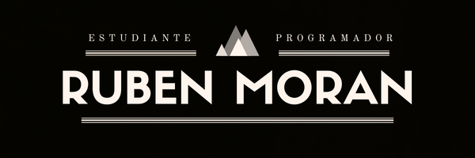
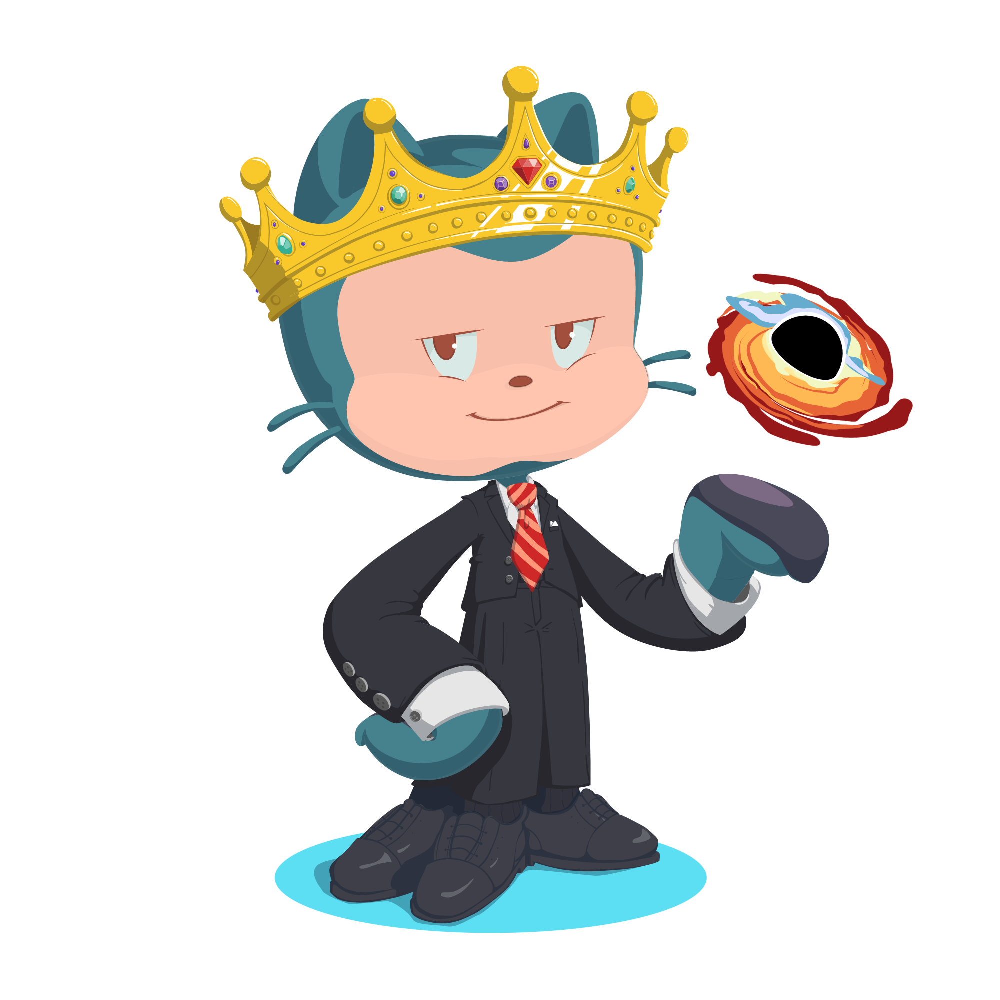

# 🙌 Buenas, soy Rubén Morán 🙌

#
Actualmente soy estudiante en el [IES Luis Vives](https://www.iesluisvives.es/) de Leganés en un ciclo de Formacion Profesional en Desarrollo de Aplicaciones Multiplataforma (DAM).

Me encuentro motivado y apasionado por el tema de la programación y con ganas de seguir aprendiendo mas cosas acerca de este fabuloso mundillo.

Poco a poco descubriendo que es lo que mas me gusta a parte de aprender 😁.
___

## 🔥 Aplicaciones y lenguajes utilizados 🔥

___

## 🗨️Contáctame💬

🔜 Proximamente 🔜